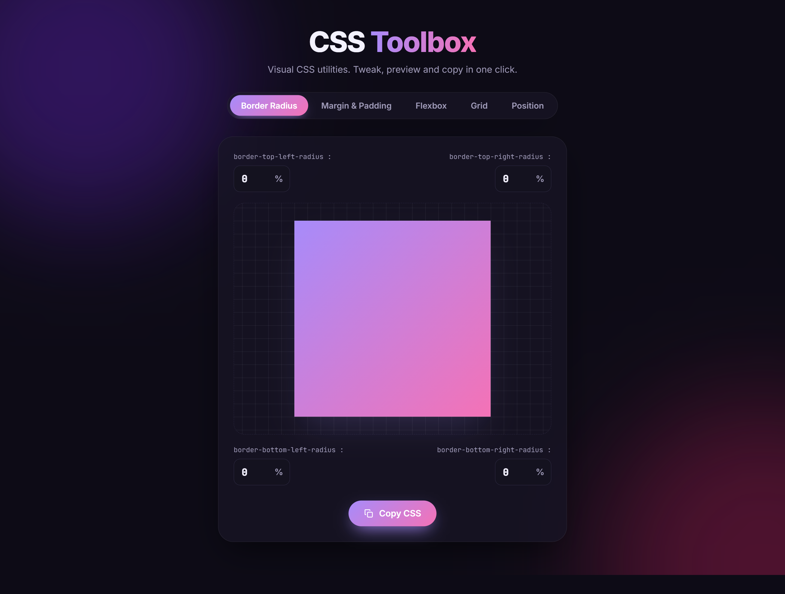
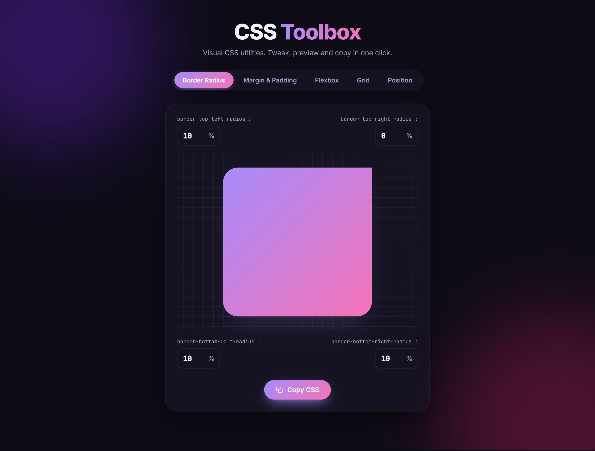
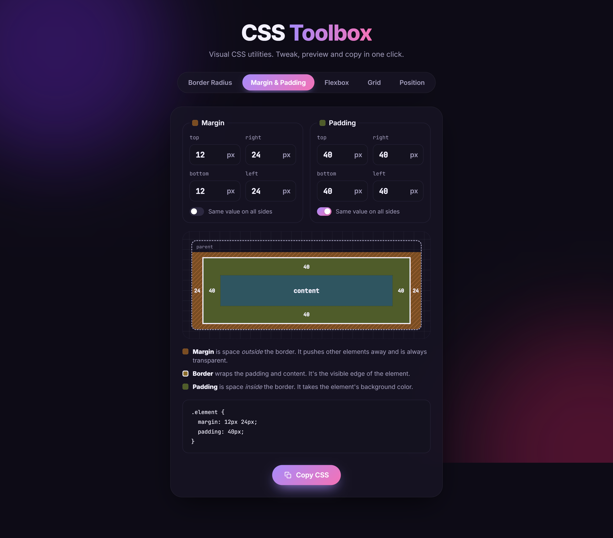
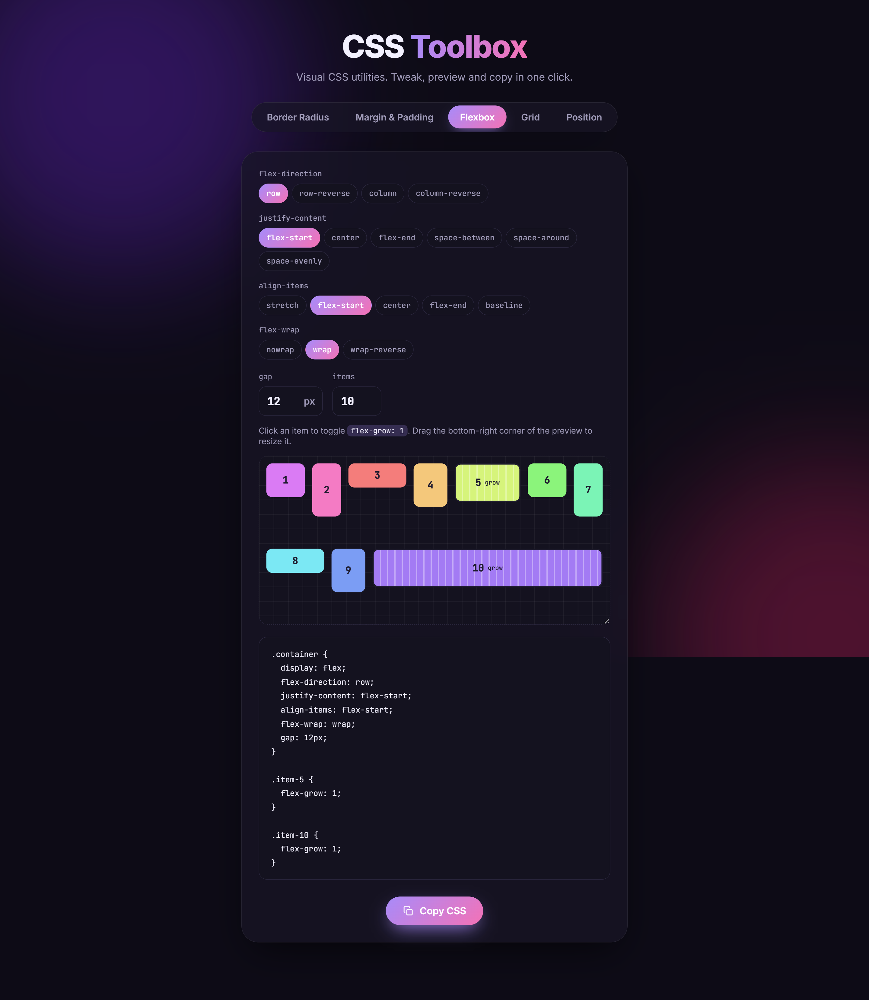
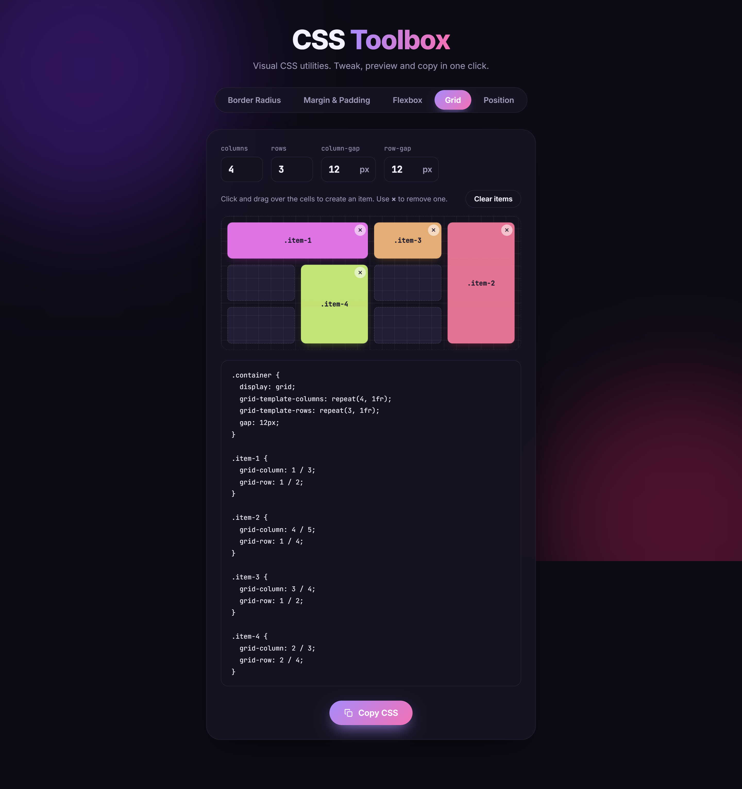
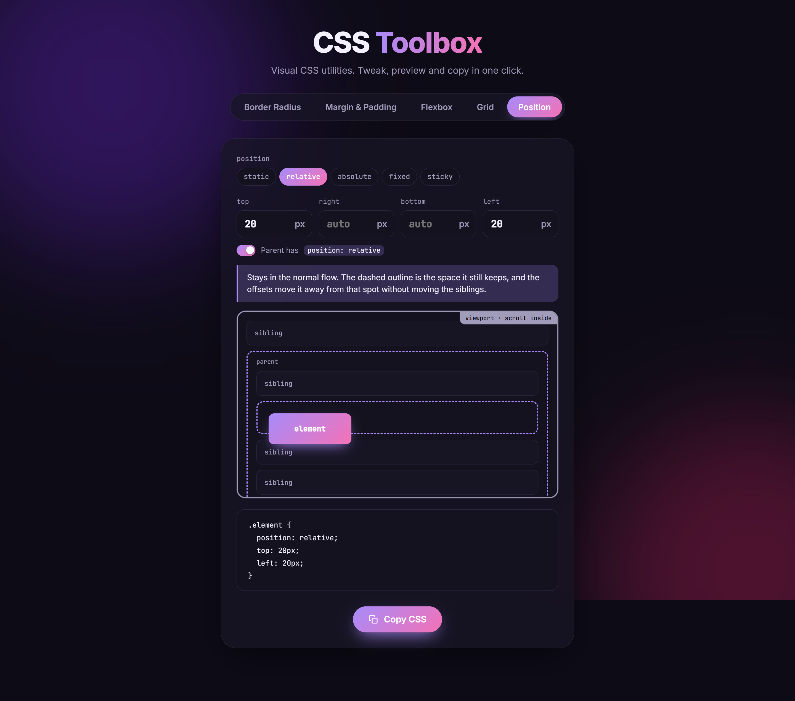

<div align="center">

# 🧰 CSS Toolbox

**Visual CSS utilities. Tweak, preview and copy in one click.**

A small collection of interactive tools that make CSS properties *visible*.
Change a value, watch the result update live, and copy production-ready CSS.


<!-- SCREENSHOT: Home page (index.html, "Border Radius" tab open — it is the default tab).
     Capture the full window: header + tab bar + the card.
     Save as: docs/screenshots/overview.png -->


</div>

---

## ✨ Features

| Tool | What it does |
| --- | --- |
| **Border Radius** | Set each corner's radius individually and see the shape change instantly. |
| **Margin & Padding** | A box-model diagram that shows margin and padding per side, with an option to link all sides. |
| **Flexbox** | A playground for `flex-direction`, `justify-content`, `align-items`, `flex-wrap`, `gap` and `flex-grow`. |
| **Grid** | Set columns, rows and gaps, then **click and drag** over cells to create grid items. |
| **Position** | Compare `static`, `relative`, `absolute`, `fixed` and `sticky`, with a plain-English explanation of each. |

Every tool generates the matching CSS, ready to **copy to your clipboard with one click**.

---

## 📸 Screenshots

### Border Radius
<!-- SCREENSHOT: Border Radius tab (index.html#radius).
     Use different values on each corner so the shape looks interesting.
     Save as: docs/screenshots/border-radius.png -->


### Margin & Padding
<!-- SCREENSHOT: Margin & Padding tab (index.html#spacing).
     Show the box-model diagram with different margin and padding values,
     plus the generated CSS code below it.
     Save as: docs/screenshots/margin-padding.png -->


### Flexbox Playground
<!-- SCREENSHOT: Flexbox tab (index.html#flexbox).
     Tip: pick something visual, e.g. justify-content: space-between + align-items: center.
     Save as: docs/screenshots/flexbox.png -->


### Grid Generator
<!-- SCREENSHOT: Grid tab (index.html#grid).
     Draw 3–4 items of different sizes by dragging over the cells.
     Optional: record a short GIF of the drag interaction instead → docs/screenshots/grid.gif
     Save as: docs/screenshots/grid.png -->


### Position Visualizer
<!-- SCREENSHOT: Position tab (index.html#position).
     Select "relative" or "absolute" with some offsets so the explanation text
     and the dashed outline are visible.
     Save as: docs/screenshots/position.png -->


---

## 🚀 Getting Started

The project is plain HTML, CSS and JavaScript — **no build step and no dependencies**.

Because the scripts use ES modules, open it through a local server (not by double-clicking `index.html`).

```bash
git clone https://github.com/davipferr/css-toolbox.git
cd css-toolbox
python -m http.server 5500
```

Then open **http://localhost:5500** in your browser.

> You can also use the **Live Server** extension in VS Code.

Each tool has its own URL, so you can link to it directly:
`#radius`, `#spacing`, `#flexbox`, `#grid`, `#position`.

---

## 🗂️ Project Structure

```
css-toolbox/
├── index.html            # Page layout and all tool panels
├── css/
│   └── main.css          # Styles
└── scripts/
    ├── tabs.js           # Accessible tab navigation (with URL hash)
    ├── index.js          # Border Radius tool
    ├── spacing.js        # Margin & Padding tool
    ├── flexbox.js        # Flexbox playground
    ├── grid.js           # Grid generator (drag to create items)
    ├── position.js       # Position visualizer
    ├── copy-css.js       # Copy generated CSS
    ├── copy-code.js      # Copy code blocks
    ├── input-change.js   # Input handling
    └── util/             # Shared helpers (chips, toast, filters)
```

---

## 🛠️ Built With

- **HTML5** — semantic markup with ARIA tabs (keyboard navigable)
- **CSS3** — custom properties, Flexbox and Grid
- **Vanilla JavaScript** — ES modules, Pointer Events and the Clipboard API

---

## 👤 Author

**Davi Pinto Ferreira** — [@davipferr](https://github.com/davipferr)

If this project helped you, consider giving it a ⭐!
